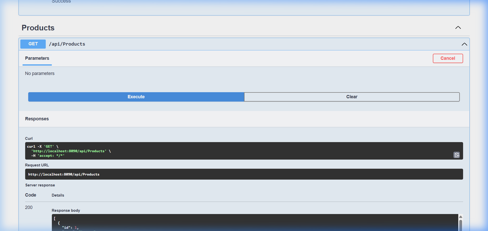

# .NET 8 API Blue-Green Deployment with Docker, Nginx & GitHub Actions

[](https://dotnet.microsoft.com/)
[](https://www.docker.com/)
[](https://nginx.org/)
[](https://github.com/features/actions)
[](https://xunit.net/)

This repository implements a production-ready **Blue-Green Deployment Architecture** for a .NET 8 Web API using Docker Compose, Nginx reverse proxy, automated Bash/PowerShell deployment scripts, and a GitHub Actions CI/CD pipeline.

---

## 📋 Submission Requirements Checklist

| Requirement | Implementation Details | Status |
| :--- | :--- | :---: |
| **GitHub Repository** | Standard structure with `.gitignore`, initialized Git repo | ✅ Complete |
| **.NET 8 Web API Code** | Clean C# 12 / .NET 8 API (`Program.cs`, `HealthController`, `ProductsController`) | ✅ Complete |
| **Dockerfile** | Optimized multi-stage Docker build (`mcr.microsoft.com/dotnet/sdk:8.0` ➔ `aspnet:8.0`) | ✅ Complete |
| **docker-compose.yml** | Orchestrates `blue-api`, `green-api`, and `nginx` reverse proxy | ✅ Complete |
| **Nginx Configuration** | Main config with dynamic upstream switching (`blue.conf`, `green.conf`, `active.conf`) | ✅ Complete |
| **Blue-Green Scripts** | Automates deploy, health check, traffic switch, rollback, and status monitoring | ✅ Complete |
| **GitHub Actions CI/CD** | Automated build, unit test execution, Docker build, and remote deployment | ✅ Complete |
| **README.md Instructions** | Full guide covering setup, local execution, deployment, and verification | ✅ Complete |
| **Demonstration Media** | Recorded video demonstration & Swagger UI screenshots included in `docs/` | ✅ Complete |

---

## 🏛️ Architecture & Traffic Flow

```text
                                +-------------------+
                                |    Developer      |
                                +---------+---------+
                                          | Git Push
                                          v
                                +-------------------+
                                |  GitHub Actions   | (CI/CD Pipeline)
                                | - Build & Test    |
                                | - Build Image     |
                                | - Execute Deploy  |
                                +---------+---------+
                                          |
                                          v
                                +-------------------+
                                |  Production Host  |
                                |                   |
                                |    +---------+    |
                                |    |  Nginx  |    | (Port 8090 - Reverse Proxy)
                                |    +----+----+    |
                                |        / \        |
                                |       /   \       |
                           Active      /     \      Inactive
                          Traffic     /       \     Container
                                     /         \    
                               +----v----+ +----v----+
                               |  BLUE   | |  GREEN  |
                               |  v1.0.0 | |  v2.0.0 |
                               +---------+ +---------+
```

---

## 📁 Repository Structure

```text
dotnet-blue-green-deployment/
├── .github/
│   └── workflows/
│       └── ci-cd.yml             # GitHub Actions CI/CD Pipeline
├── docker/
│   └── nginx/
│       ├── nginx.conf            # Main Nginx proxy configuration
│       ├── blue.conf             # Upstream definition for blue-api (port 8090)
│       ├── green.conf            # Upstream definition for green-api (port 8090)
│       └── active.conf           # Active upstream symlink/target (dynamically updated)
├── docs/
│   ├── demo.webp                 # Recorded demonstration video of deployment workflow
│   └── swagger_demo.png          # Screenshot of Swagger UI API execution
├── scripts/
│   ├── deploy.sh                 # Deployment orchestrator (detects active -> deploys -> checks -> switches)
│   ├── health-check.sh           # Polls target container /api/health endpoint
│   ├── switch-traffic.sh         # Validates Nginx syntax & reloads Nginx dynamically
│   ├── rollback.sh               # Instantly reverts Nginx traffic to previous environment
│   └── status.sh                 # Displays environment state, health, version, and active route
├── src/
│   └── BlueGreenApi/
│       ├── Controllers/
│       │   ├── HealthController.cs   # Returns Status, Environment (BLUE/GREEN), Version
│       │   └── ProductsController.cs # Business endpoint (GET /api/products)
│       ├── Models/
│       │   └── Product.cs            # Product data POCO
│       ├── Program.cs                # ASP.NET Core minimal entry point
│       └── BlueGreenApi.csproj
├── tests/
│   └── BlueGreenApi.Tests/           # xUnit integration and unit tests (5/5 tests)
├── .dockerignore
├── .env.example
├── .gitignore
├── Dockerfile                        # Multi-stage container build
├── docker-compose.yml                # Compose stack definition
├── run.ps1                           # Windows PowerShell helper for scripts
└── README.md                         # Project documentation
```

---

## 🎬 Demonstration Media

### Live Swagger UI & API Execution


### Video Demonstration
The recorded demonstration showing the Blue-Green deployment and automated traffic switching is saved in `docs/demo.webp`.

---

## 💻 How to Run the Application Locally

### Method 1: Running with Docker Compose (Recommended)

1. **Clone the repository**:
   ```bash
   git clone <repository-url>
   cd dotnet-blue-green-deployment
   ```

2. **Build and start the container stack**:
   ```bash
   docker build -t blue-green-api:latest -f Dockerfile .
   docker compose up -d
   ```

3. **Verify running services**:
   - **Swagger UI**: [http://localhost:8090/swagger](http://localhost:8090/swagger)
   - **Health Check**: [http://localhost:8090/api/health](http://localhost:8090/api/health)
   - **Products API**: [http://localhost:8090/api/products](http://localhost:8090/api/products)

---

### Method 2: Running directly with .NET 8 SDK

```powershell
cd src/BlueGreenApi
dotnet run
```
Access Swagger UI at `http://localhost:5000/swagger`.

---

## 🔄 Executing Blue-Green Deployments

You can manage deployments on **Windows (PowerShell)** or **Linux/macOS (Bash)**.

### 1. Check Current Environment Status

```powershell
# Windows PowerShell:
.\run.ps1 status

# Linux/macOS Bash:
bash ./scripts/status.sh
```

**Output**:
```text
BLUE:   Status: running | Health: healthy | Version: 1.0.0
GREEN:  Status: running | Health: healthy | Version: 2.0.0
Active Environment: BLUE
```

---

### 2. Perform Blue-Green Deployment

To deploy a new version (automatically detects active environment, deploys to inactive, runs health checks, and switches Nginx traffic):

```powershell
# Windows PowerShell:
.\run.ps1 deploy

# Linux/macOS Bash:
bash ./scripts/deploy.sh
```

**Output**:
```text
============================================================
Starting Blue-Green Deployment (Version: latest)
============================================================
Current environment: BLUE
Target environment : GREEN
------------------------------------------------------------
Starting GREEN container...
Running health check on GREEN environment...
Attempt 1/10...
✅ GREEN is Healthy!
------------------------------------------------------------
GREEN health check passed. Proceeding with traffic switch.
Switching traffic to GREEN...
Validating Nginx configuration...
✅ Nginx configuration is valid.
Reloading Nginx...
✅ Traffic successfully switched to GREEN.
============================================================
🎉 DEPLOYMENT SUCCESSFUL!
Active Environment: GREEN
============================================================
```

---

### 3. Verify Live Endpoint Traffic Switch

```powershell
Invoke-RestMethod http://localhost:8090/api/health
```

**Response**:
```json
{
  "status": "Healthy",
  "environment": "GREEN",
  "version": "2.0.0",
  "timestamp": "2026-09-02T13:38:03.62Z",
  "machineName": "0b093f3011de"
}
```

---

### 4. Execute Instant Rollback

If issues are detected, instantly revert traffic to the previous healthy container without downtime:

```powershell
# Windows PowerShell:
.\run.ps1 rollback

# Linux/macOS Bash:
bash ./scripts/rollback.sh
```

**Output**:
```text
============================================================
Starting Rollback Procedure
============================================================
Current active environment : GREEN
Rolling back to            : BLUE
------------------------------------------------------------
Running health check on BLUE environment...
✅ BLUE is Healthy!
Proceeding with rollback switch.
✅ Traffic successfully switched to BLUE.
============================================================
⏪ ROLLBACK SUCCESSFUL!
Active Environment: BLUE
============================================================
```

---

## 🧪 Automated Testing

Run the xUnit test suite (5 tests covering API controllers, health endpoints, environment variable overrides, and 404 responses):

```powershell
dotnet test tests/BlueGreenApi.Tests/BlueGreenApi.Tests.csproj
```

---

## ⚙️ CI/CD Pipeline (GitHub Actions)

The `.github/workflows/ci-cd.yml` workflow triggers on push to `main`:

1. **Build & Test**: Restores dependencies, builds `.NET 8` code, and runs all xUnit tests.
2. **Docker Build**: Builds immutable image tagged with `github.sha`.
3. **Automated SSH Deployment**: SSHs to remote target server and executes `deploy.sh`.

### Required GitHub Secrets:
* `DEPLOY_HOST`: Production server IP/domain.
* `DEPLOY_USER`: SSH username.
* `DEPLOY_SSH_KEY`: SSH private key
